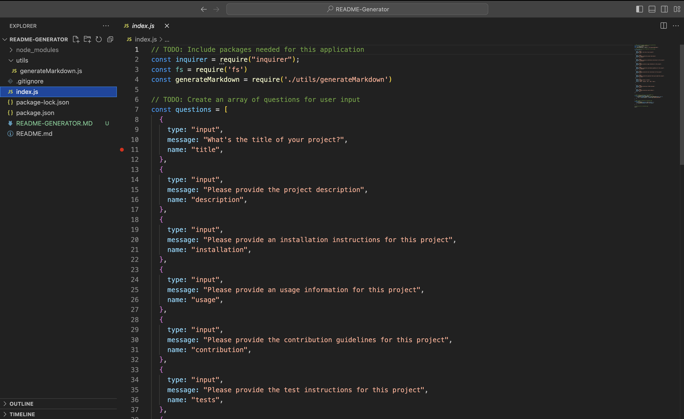
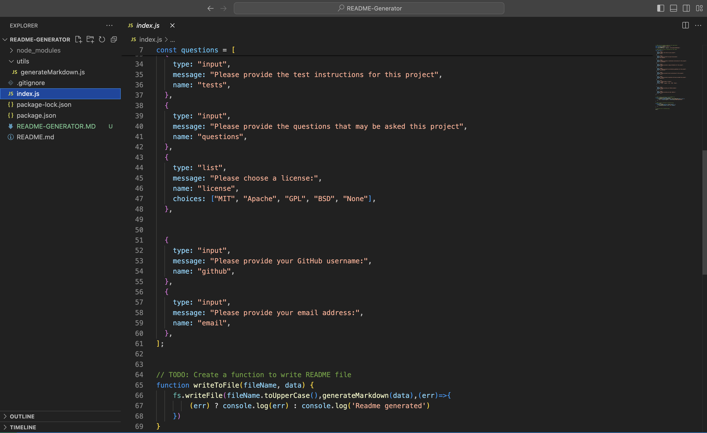
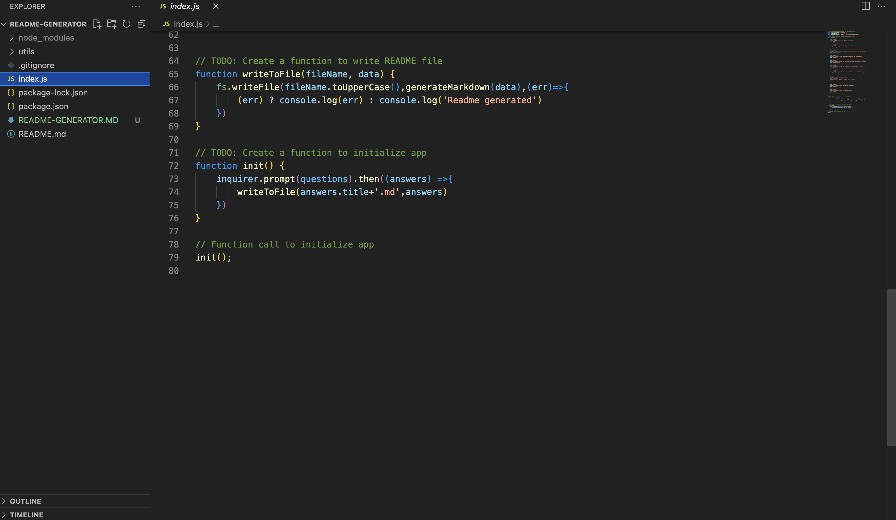
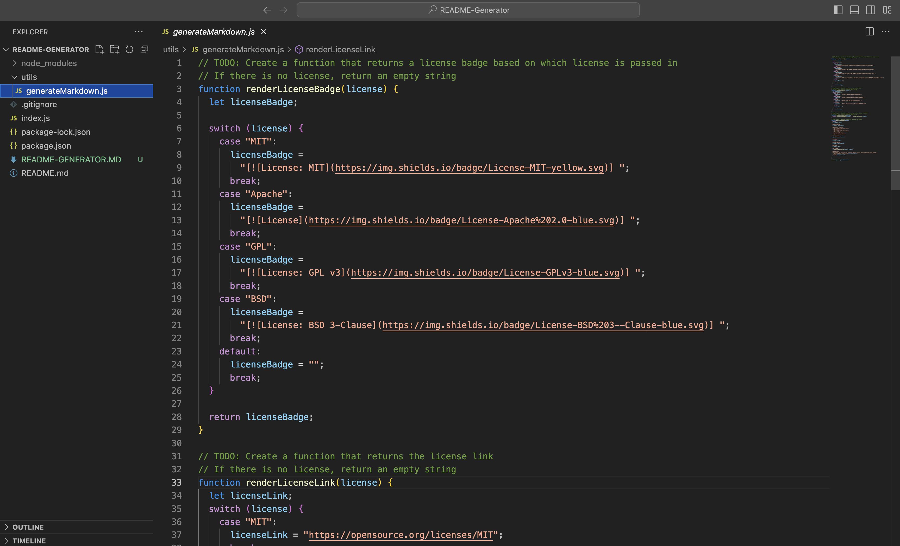
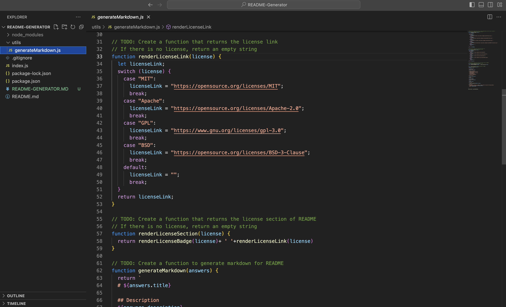
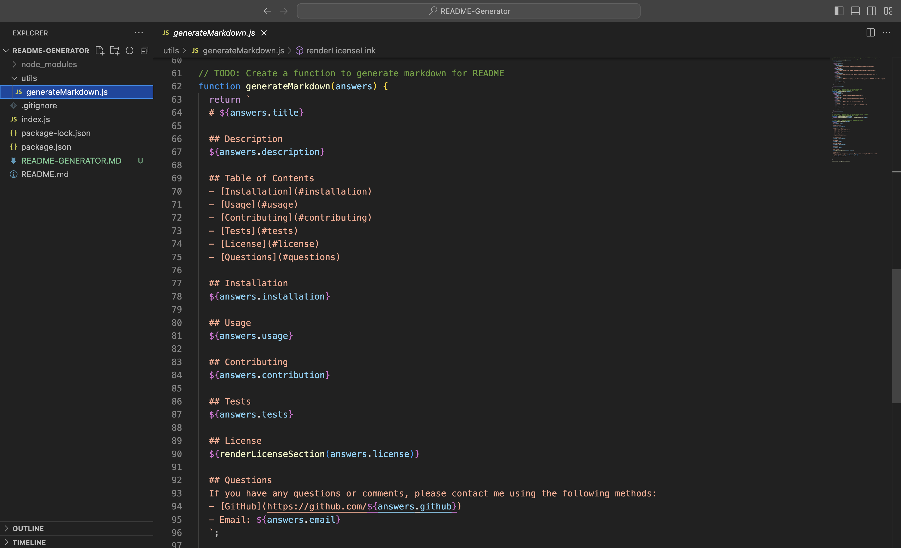
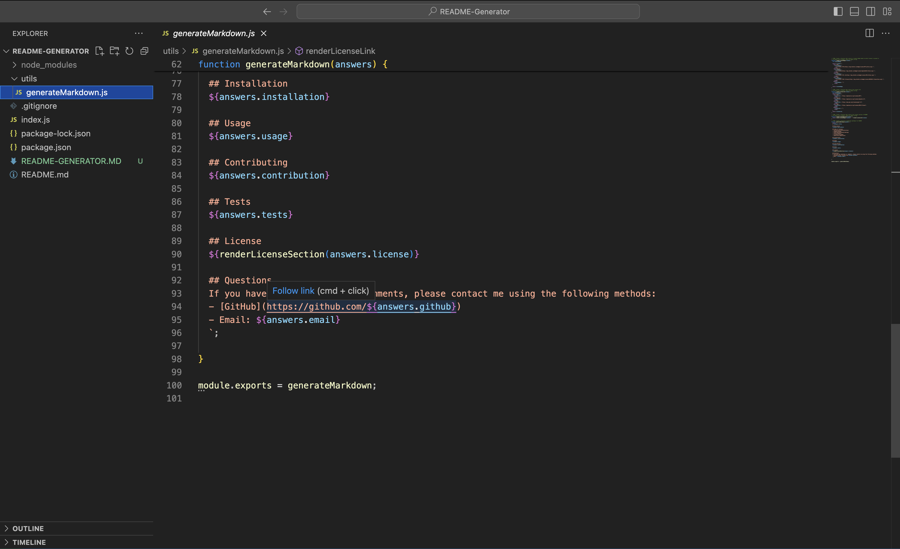
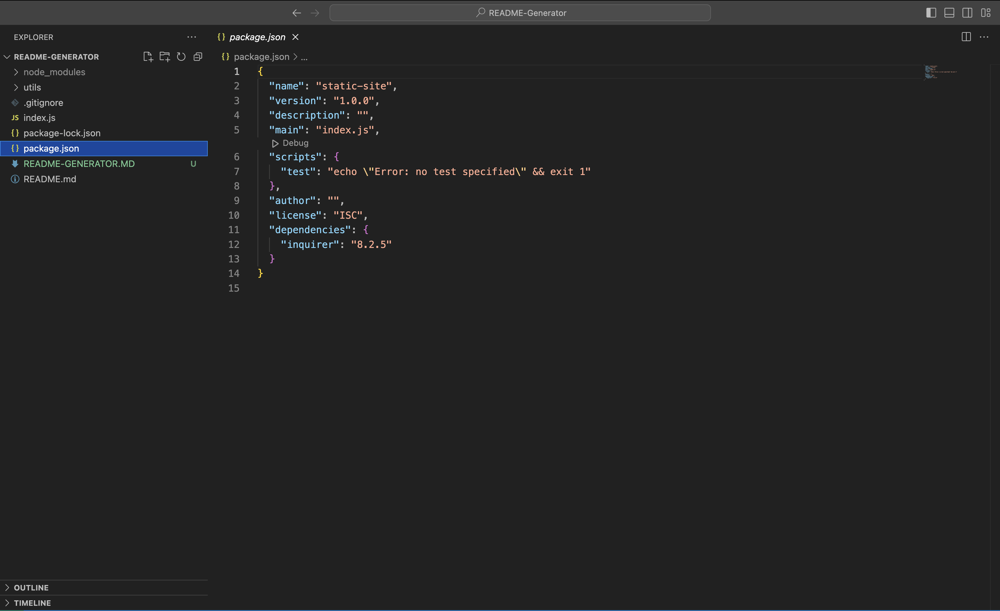
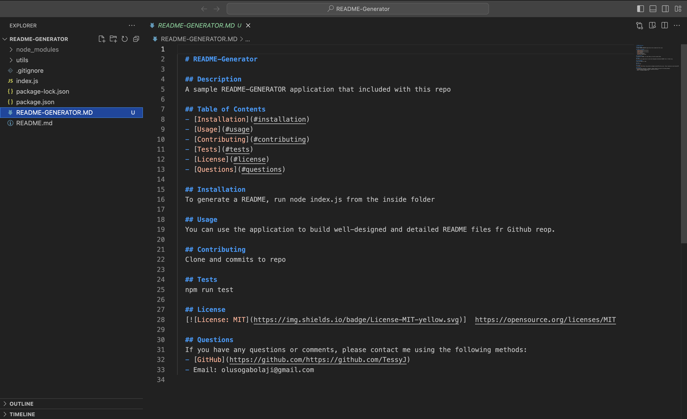

# README-Generator

# Project Name - README GENERATOR

# Project URL

https://tessyj.github.io/README-Generator/

# Project Repository

https://github.com/TessyJ/README-Generator

# Project Description

A high-quality README Generator accepts user input generated with the title of my project, Description, Table of Contents, Installation, Usage, License, Contributing, Tests, and Questions.
 

A badge for that license is added to the README, GitHub username with a link to my GitHub profile and my email address.
 

A Links in the Table of Contents to the corresponding section of the README present.

# The walkthrough video link

https://drive.google.com/file/d/1IrLLOAD1ShduImvLpgLu77RL7hp7bS4x/view
# Screen Shot

